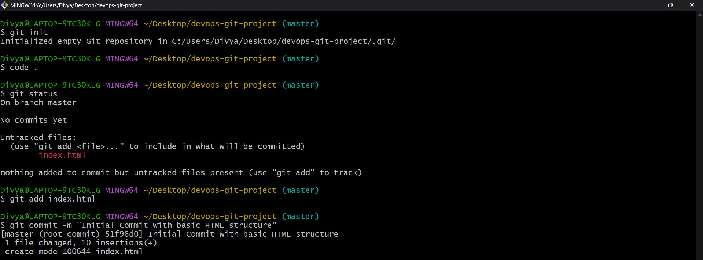
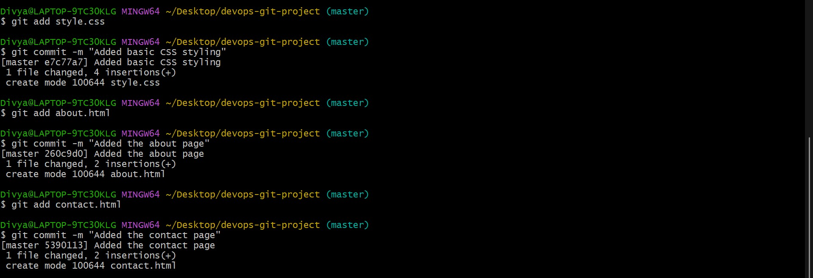
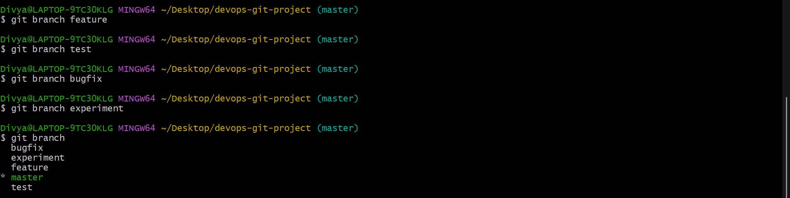
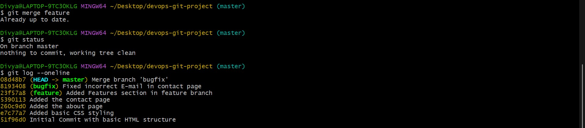
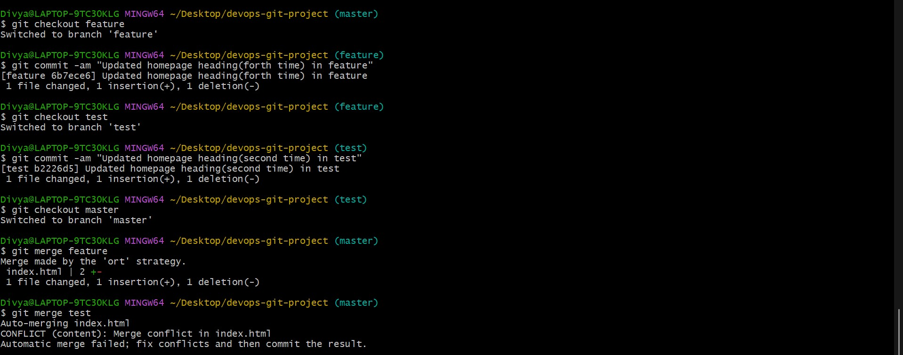
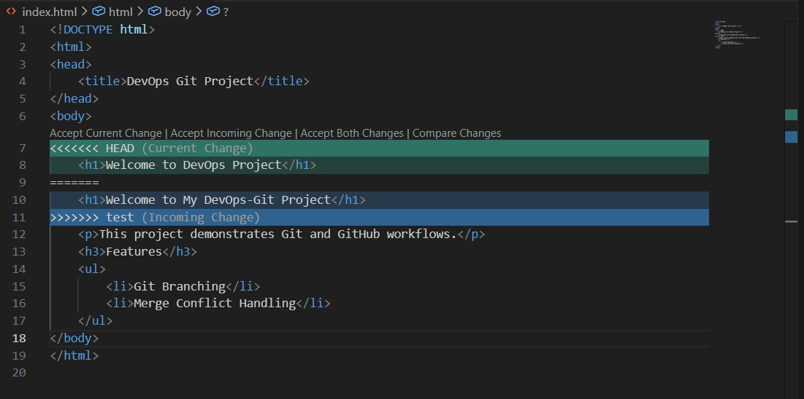
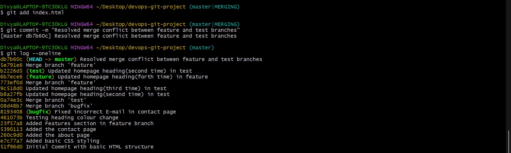
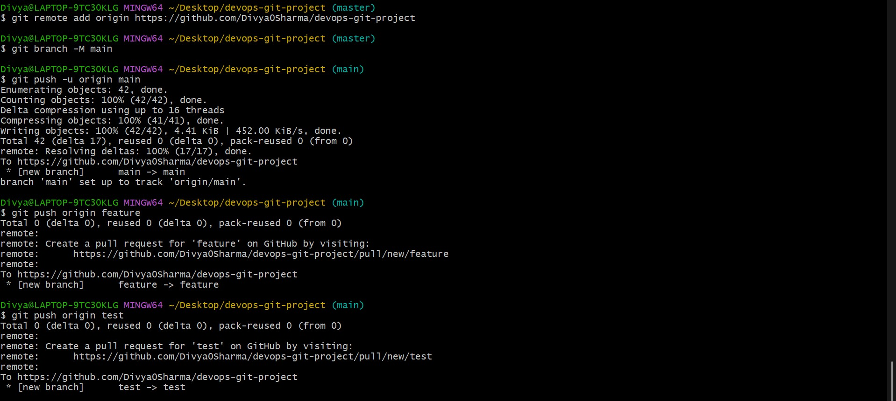
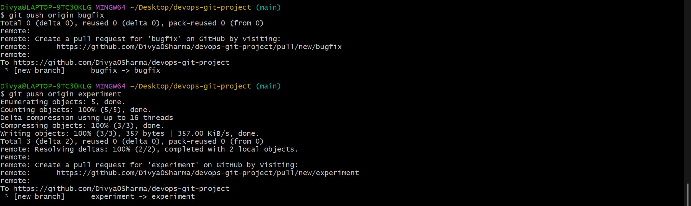
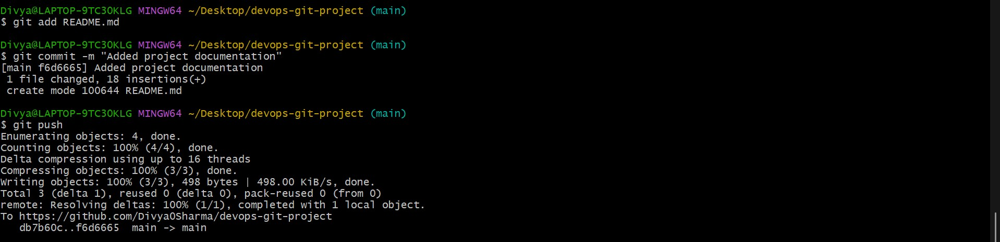

# DevOps Git Project

This project demonstrates Git and GitHub workflows including branching,
merging, and conflict resolution.

## Branches
- feature
- test
- bugfix
- experiment

## Tools Used
- Git Bash
- GitHub
- HTML, CSS

## Command Screenshots

## Conclusion
This project helped in understanding real-world DevOps version control practices.
